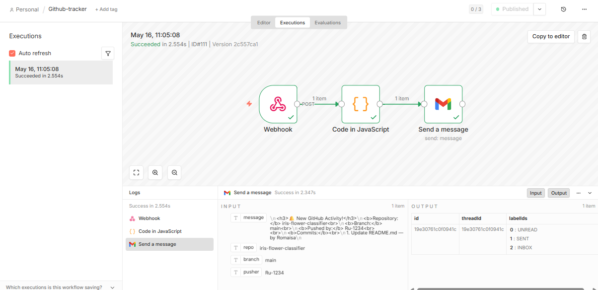
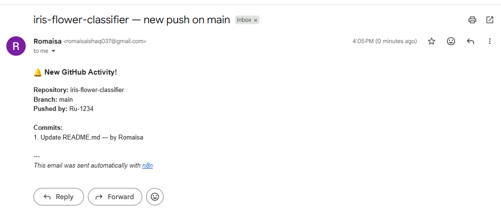

# GitHub Activity Tracker with n8n

An event-driven automation workflow built using n8n, GitHub Webhooks, ngrok, and Gmail. Whenever a new commit is pushed to a GitHub repository, this workflow instantly sends an email notification containing:

- Repository name
- Branch name
- Pusher username
- Commit messages
- Commit authors

---

## Tech Stack

- n8n
- GitHub Webhooks
- Gmail API
- ngrok
- JavaScript

---

## Workflow Overview

```text
GitHub Push Event
        ↓
     Webhook
        ↓
Code Processing
        ↓
Gmail Notification
```

This project demonstrates:

- Webhook-based automation
- Event-driven systems
- Real-time notifications
- JSON payload handling
- JavaScript data transformation inside n8n

---

## Features

- Real-time GitHub push tracking
- Instant email alerts
- HTML formatted emails
- Branch detection
- Multi-commit support
- Event-driven architecture

---

## Screenshots

### n8n Workflow


### Email Notification Output



---

## Setup Guide

### 1. Start n8n

Run n8n locally:

```bash
n8n start
```

Default URL:

```text
http://localhost:5678
```

---

### 2. Expose Localhost Using ngrok

Install ngrok and run:

```bash
ngrok http 5678
```

Example public URL:

```text
https://abc123.ngrok-free.app
```

Keep ngrok running while testing webhooks.

---

### 3. Import Workflow into n8n

1. Open n8n
2. Click **Import Workflow**
3. Upload:

```text
github-activity-tracker-workflow.json
```

---

### 4. Configure GitHub Webhook

Go to:

```text
GitHub Repository → Settings → Webhooks → Add Webhook
```

Configure the webhook using the following settings:

| Field | Value |
|---|---|
| Payload URL | `https://your-ngrok-url/webhook/github-tracker` |
| Content Type | `application/json` |
| Events | `Just the push event` |

Save the webhook.

---

### 5. Configure Gmail Credentials

Inside n8n:

1. Open the Gmail node
2. Connect your Gmail OAuth account
3. Save credentials

---

### 6. Activate Workflow

Toggle the workflow status to:

```text
Active
```

Push a commit to your GitHub repository.

You should receive an email notification instantly.

---

## Webhook Payload Example

GitHub sends payload data like this:

```json
{
  "ref": "refs/heads/main",
  "pusher": {
    "name": "username"
  },
  "repository": {
    "name": "my-repo"
  },
  "commits": [
    {
      "message": "Initial commit"
    }
  ]
}
```

---

## JavaScript Logic Used

The Code node:

- Extracts repository details
- Detects branch name
- Formats commit messages
- Generates HTML email content

Core logic:

```javascript
const branch = body.ref.replace("refs/heads/", "");
```

This removes `refs/heads/` from the GitHub reference string and extracts only the branch name.

Example:

```text
refs/heads/main → main
```

---

## Key Concepts Learned

### Polling

An application repeatedly checks for updates at fixed intervals.

### Webhooks

A service instantly sends data when an event occurs.

This project uses an event-driven webhook system for real-time automation.

---

## Future Improvements

- Slack notifications
- Discord integration
- Commit filtering
- Issue tracking alerts
- Pull request notifications
- Database logging

---

## 📄 License
This project is licensed under the MIT License.
